<div align="center">

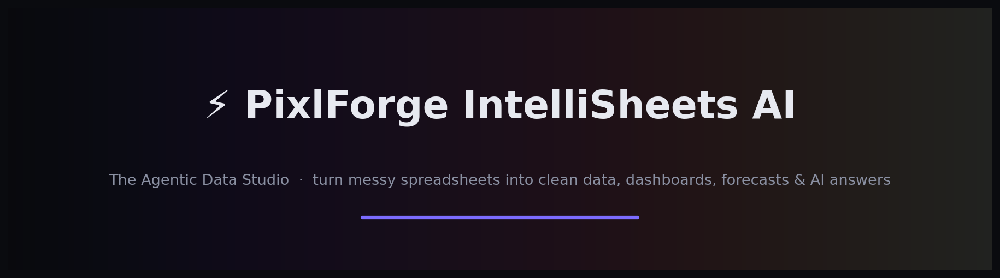

# ⚡ PixlForge IntelliSheets AI

### The Agentic Data Studio — turn messy spreadsheets into clean data, dashboards, forecasts & AI answers, 100% on your own machine.


</div>

> **🔒 Proprietary software — © 2026 PixlForge Studio. All rights reserved.**
> This is a **showcase** repository. The full source code is private and provided only
> under licence. You may **view** these materials; you may **not** copy, reuse, or
> reproduce them. See [LICENSE](LICENSE) · 📬 **pixlforge.studio03@gmail.com**

---

## 💡 What it is

A premium, **self-hosted** data studio for accountants, finance teams and analysts.
Drop in a messy spreadsheet and in seconds it **cleans** the data, **profiles** every
column, scores **quality**, builds an interactive **dashboard** (including 3D),
**forecasts** trends, **benchmarks** you against your industry, and lets you **talk to
your data in plain English** with your own AI key — then exports a **branded PDF**.

Everything runs on the machine you start it on. **Your data never leaves your computer.**

---

## 📸 See it in action

### Auto Dashboard — built the instant your file lands
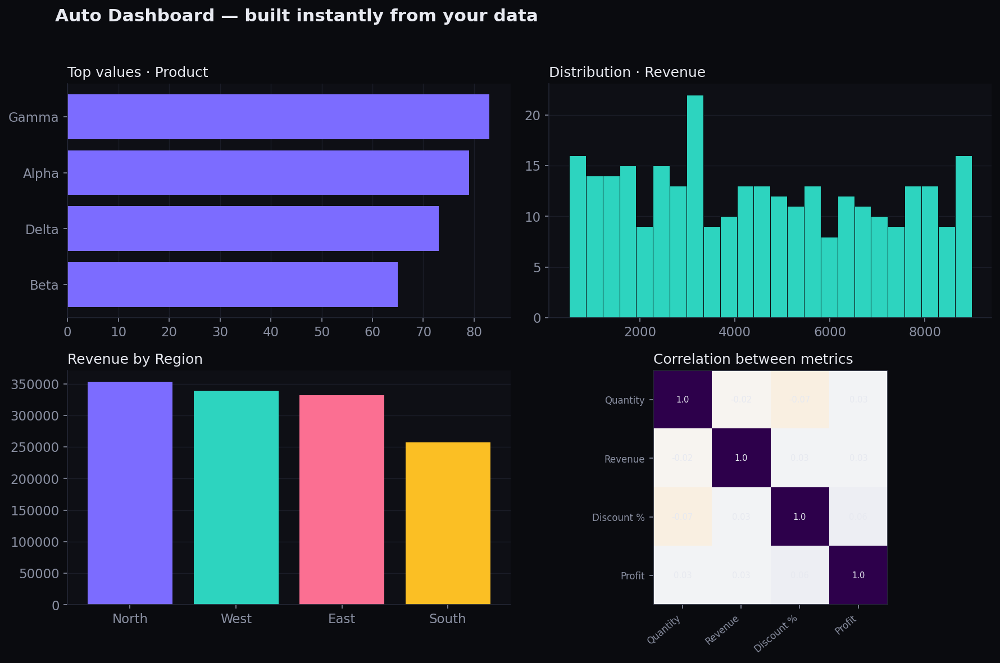

### Predictive Forecast — 90-day / 6-month / 1-year horizons with confidence bands
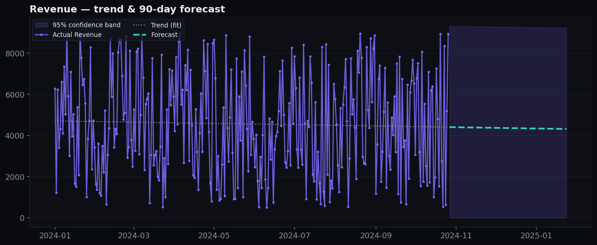

### 3D Explorer — three measures at once, rotate & zoom to find clusters and outliers
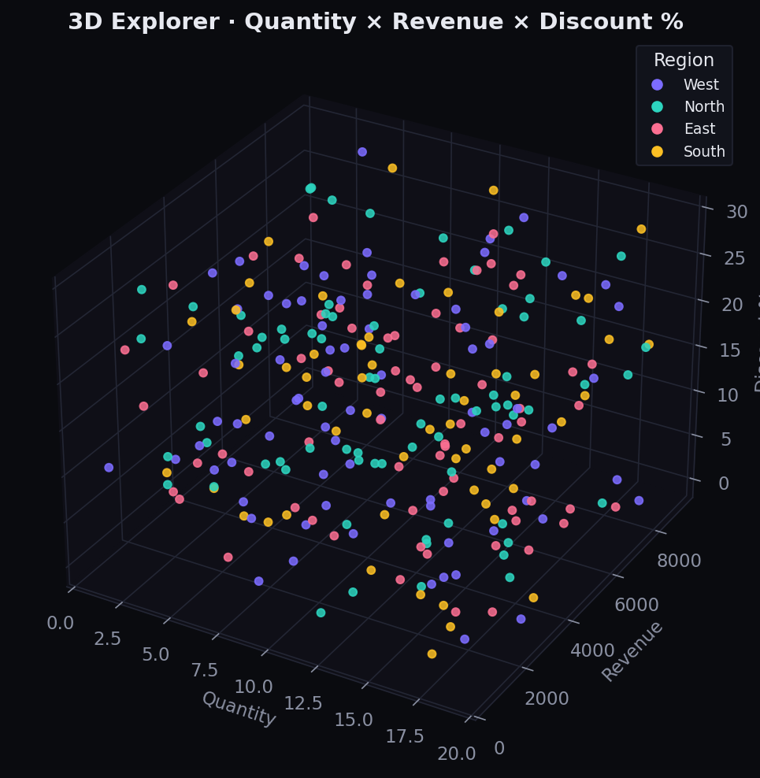

> *Visuals above are rendered from the included sample data.*

---

## 🖥️ Inside the app

> **📌 Add your own screenshots:** drop PNG files into `assets/screenshots/` using the
> exact names below and they'll appear here automatically. See
> [`assets/screenshots/HOW_TO_ADD.md`](assets/screenshots/HOW_TO_ADD.md).

| | |
|---|---|
| **Upload & Profile** — quality score, industry & summary<br>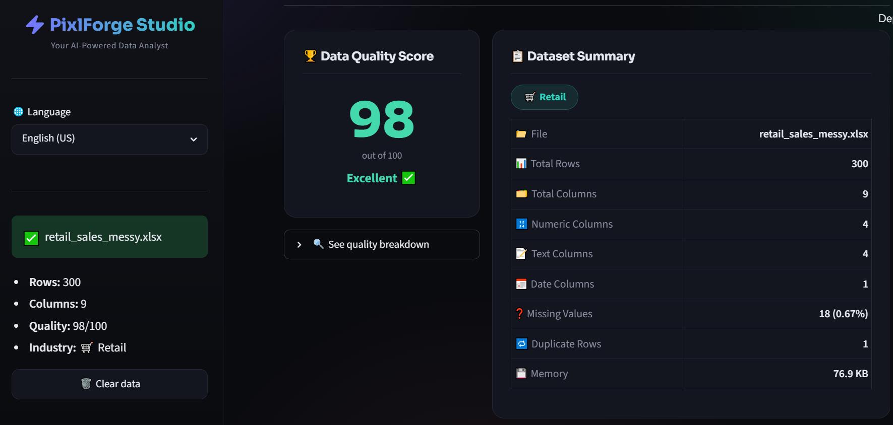 | **Column Intelligence** — types, stats, missing %<br>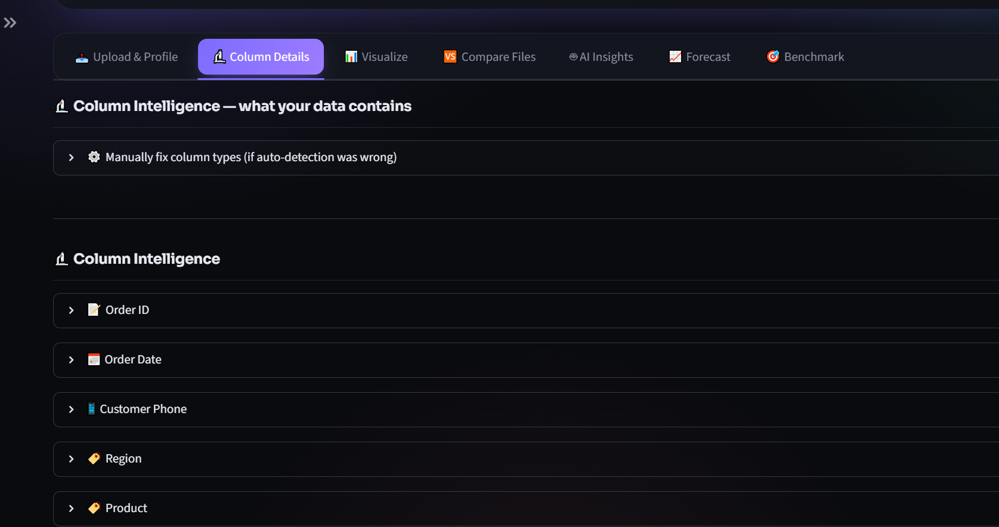 |
| **Visualize** — auto 2D dashboard<br>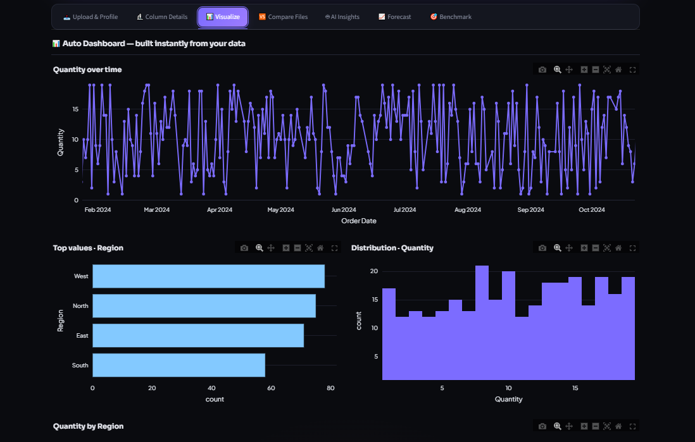 | **3D Explorer** — rotate & zoom to find clusters<br>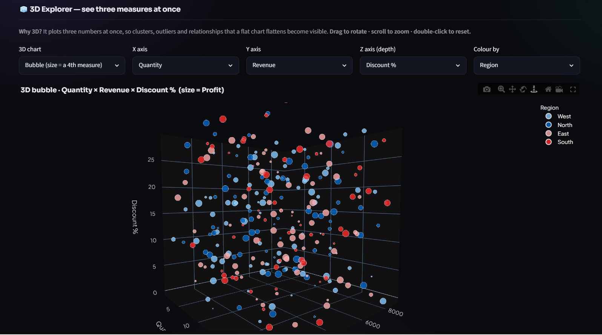 |
| **Compare Files** — month-over-month<br>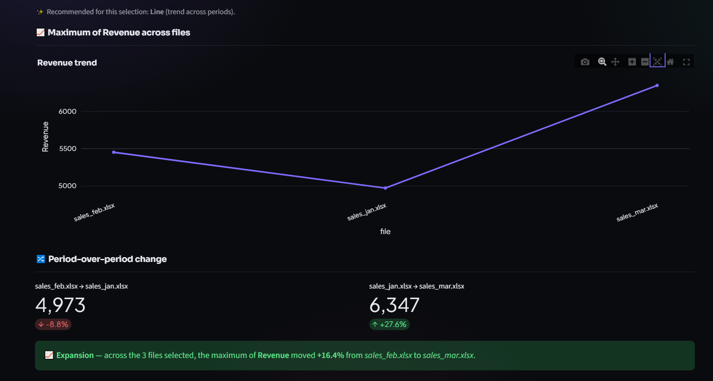 | **AI Analyst** — chat with your data<br>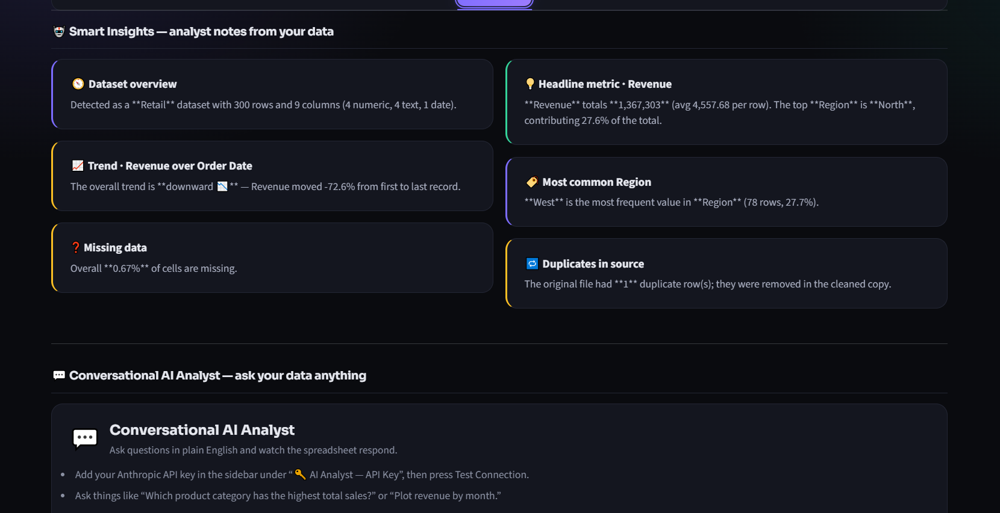 |
| **Forecast** — 90d / 6mo / 1yr horizons<br>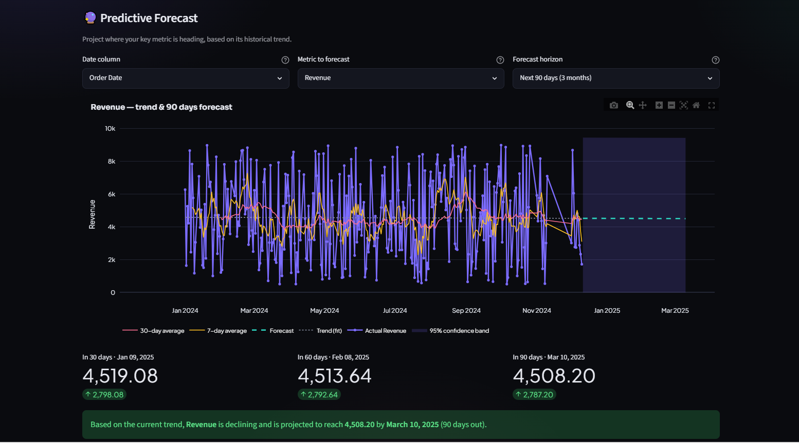 | **Benchmark** — vs industry margins<br>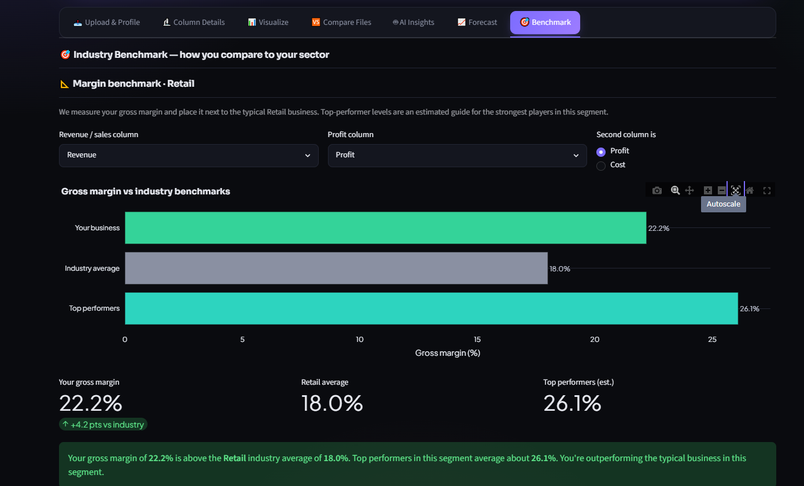 |
| **Export Center** — branded PDF report<br>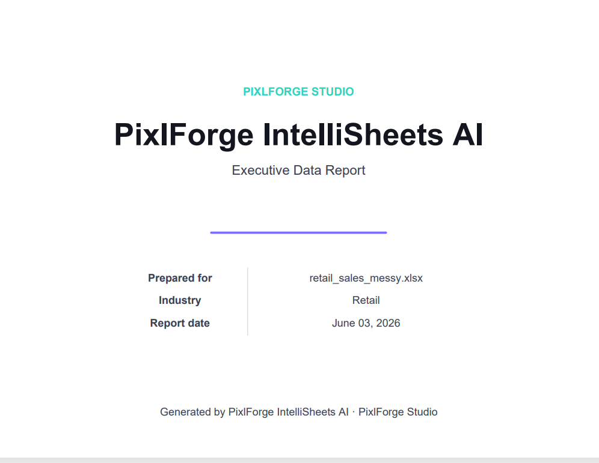 | **AI Analyst — API key setup**<br>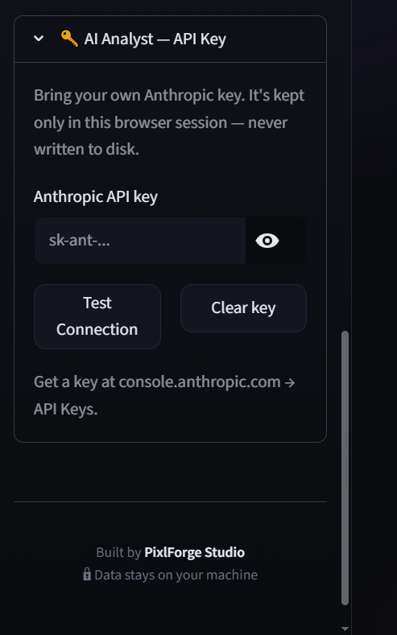 |

---

## ✨ Features

| Area | What it does |
|------|------|
| 📤 **Upload & Profile** | CSV, Excel (multi-sheet), JSON, TSV, Parquet, and **Tally Prime XML**. Up to **10 files at once**, each cleaned & cached independently with instant active-file switching. Quality score + industry auto-detect + plain-English summary. |
| 🔬 **Column Intelligence** | Per-column type, stats, missing %, with manual type overrides. |
| 📊 **Visualize** | Auto 2D dashboard **+ a 🧊 3D Explorer** (Scatter / Bubble / Surface / Line) with a plain-English "how to read it". Zoom · pan · rotate · export on every chart. |
| 🆚 **Compare Files** | Month-over-month comparison that **reuses your loaded files** — metric, aggregation, breakdown & chart type. |
| 🤖 **AI Analyst** | Bring your own Claude key and **chat with your data**. Returns the reasoning, the exact code it ran, and a chart/table/answer — all in a **sandboxed** runtime. |
| 📈 **Forecast** | Linear-regression trend, moving averages, confidence bands, selectable **90-day / 6-month / 1-year** horizon. |
| 🎯 **Benchmark** | Your gross margin vs the industry average and top performers, with a written verdict. |
| 📥 **Export Center** | Cleaned CSV / Excel / JSON + a **branded PDF executive report** (optional password). |

---

## 🔄 How it works

```
        ┌──────────────────────────────────────────────────────────┐
        │  Upload  →  CSV · Excel · JSON · TSV · Parquet · Tally XML │
        └───────────────────────────┬──────────────────────────────┘
                                     ▼
     Auto-clean  ──►  Profile + Quality score  ──►  Industry detect
   (identifier-safe,        (per-column types,        (retail, finance,
    locale-aware)            missing %, stats)          HR, logistics …)
                                     │
   ┌────────────┬──────────────┬─────┴───────┬───────────────┬─────────────┐
   ▼            ▼              ▼             ▼               ▼             ▼
 📊 Visualize  🆚 Compare    📈 Forecast   🎯 Benchmark   🤖 AI Analyst  📥 Export
 2D + 3D       month/month   90d/6mo/1yr   vs industry    (your key)     CSV/XLSX/
 dashboard                                                 chat w/ data   JSON/PDF
```

**Without an AI key:** cleaning, profiling, charts, comparison, forecasting,
benchmarking and PDF export all work — fully local.
**With your AI key:** the conversational analyst unlocks.

---

## 🧱 Project structure

```
pixlforge-intellisheets/
├── app.py                 # main Streamlit app (7 tabs, multi-file engine)
├── branding.py            # 🏷️ single source of truth for ALL branding (white-label)
├── config.py              # palette, locales, thresholds, benchmarks, settings
├── data_processor.py      # load + clean (identifier-safe, locale-aware, Tally-aware)
├── data_profiler.py       # column typing, quality score, industry detect
├── visualizer.py          # auto-charts + 3D Explorer + custom chart builder
├── insights.py            # local rule-based analyst notes
├── comparator.py          # multi-file comparison workspace
├── agent.py               # AI analyst engine + safe execution sandbox
├── forecasting.py         # trend forecasting (selectable horizon)
├── benchmarking.py        # industry margin benchmarking
├── tally_parser.py        # Tally Prime XML → DataFrame
├── pdf_report.py          # branded PDF executive report
├── ui_components.py        # premium theme + components
├── locales/               # 10-language i18n
├── sample_data/           # sample spreadsheets + Tally XML
└── assets/                # showcase visuals
```

*(File names are shown for transparency. The implementation is proprietary.)*

---

## 🛠️ Tech stack

**Python** · **Streamlit** (UI) · **pandas** / **numpy** (data) · **Plotly** (interactive
charts incl. 3D) · **scikit-learn** (forecasting) · **reportlab** + **matplotlib** (PDF) ·
**Anthropic Claude** (bring-your-own-key AI analyst).

---

## 🔐 Privacy & safety

- ✅ Processed **in memory on your own machine** — nothing is uploaded to a server.
- ✅ Nothing written to a database; the session clears when you close the tab.
- ✅ The **only** optional outbound call is to Anthropic's API — and only if *you* add your own key (kept in session, never written to disk).
- ✅ Model-generated code runs in a **restricted sandbox** (no file, network, or import access).
- ✅ Designed to align with **GDPR, CCPA & India's DPDP Act 2023** principles.

---

## 🏷️ White-label ready

Every brand-facing string, colour and logo lives in **one file** (`branding.py`). Flip
`white_label_mode = True`, set the client's name / email / logo, and the entire app —
header, footer, PDF cover & footer, download filenames — re-brands instantly:

```python
app_name         = "Acme Insights"
studio_name      = "Acme Analytics"
support_email    = "support@acme.com"
accent_color     = "#0EA5E9"
logo_path        = "assets/acme_logo.png"
white_label_mode = True
```

---

## 📜 License & contact

**Proprietary — © 2026 PixlForge Studio. All rights reserved.** Not open source.
See [LICENSE](LICENSE).

> 💼 **Available for commercial licensing — contact pixlforge.studio03@gmail.com for pricing.**

📬 **pixlforge.studio03@gmail.com** · Built by **Naman Jain**
